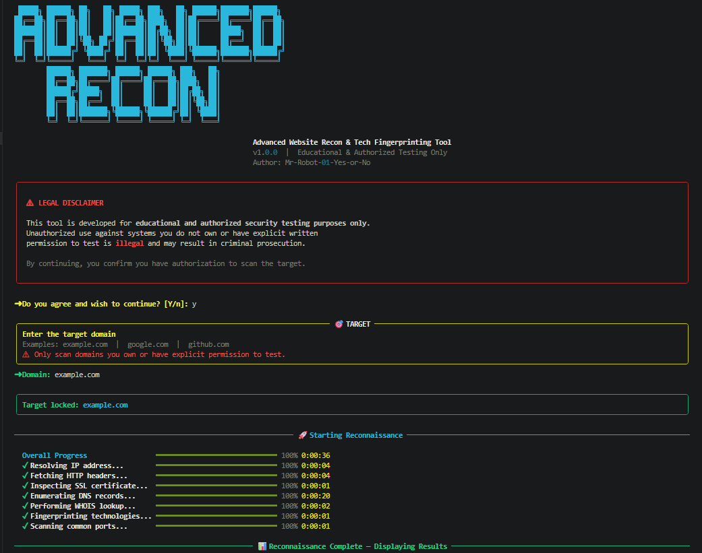
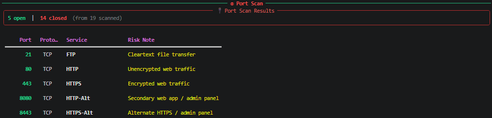

<div align="center">

# 🔥 Advanced Recon Tool

### Advanced Website Reconnaissance & Tech Fingerprinting Framework


<br>

🚀 Professional cybersecurity reconnaissance framework for infrastructure analysis,
DNS enumeration, SSL inspection, technology fingerprinting, and attack surface discovery.

</div>

---

# 📌 Overview

This project simulates real-world reconnaissance workflows used during:

* Penetration Testing
* Bug Bounty Recon
* Infrastructure Enumeration
* Security Assessments
* Attack Surface Mapping

The tool automates infrastructure intelligence gathering while presenting results through a visually rich terminal interface powered by Rich.

---

# ⚡ Core Features

<div align="center">

| Feature                | Description                           |
| ---------------------- | ------------------------------------- |
| 🌐 DNS Enumeration     | A, MX, NS, TXT & CNAME Analysis       |
| 🔐 SSL Inspection      | TLS Version, Issuer & Expiry Analysis |
| 🔒 Security Headers    | Security Posture Assessment           |
| ⚙️ Tech Fingerprinting | CMS, Framework & Server Detection     |
| 🔌 Port Scanning       | Open Service Enumeration              |
| 📄 Reporting           | JSON & TXT Export                     |
| 🎨 Rich UI             | Professional Terminal Dashboard       |

</div>

---

# 🖥 Screenshots

## 🚀 Recon Workflow

<p align="center">

</p>

---

## 🔒 Security Header Analysis

<p align="center">

</p>

---

## 🔌 Port Scan Results

<p align="center">

</p>

---

# 🧠 Recon Workflow

```txt
Target Input
     ↓
IP Resolution
     ↓
HTTP Header Analysis
     ↓
SSL/TLS Inspection
     ↓
DNS Enumeration
     ↓
WHOIS Intelligence
     ↓
Technology Fingerprinting
     ↓
Port Scanning
     ↓
Report Generation
```

---

# 🛠 Tech Stack

<div align="center">

| Technology   | Purpose            |
| ------------ | ------------------ |
| Python 3     | Core Development   |
| Rich         | Terminal UI        |
| Requests     | HTTP Analysis      |
| DNSPython    | DNS Enumeration    |
| Python-WHOIS | WHOIS Intelligence |
| Socket       | Networking         |
| SSL          | TLS Inspection     |

</div>

---

# 📂 Project Structure

```txt
advanced-recon-tool/
│
├── main.py
├── requirements.txt
├── README.md
│
├── reports/
├── screenshots/
│
└── modules/
```

---

# ⚙️ Installation

```bash
git clone https://github.com/Mr-Robot-01-Yes-or-No/advanced-recon-tool.git

cd advanced-recon-tool

python -m pip install -r requirements.txt
```

---

# ▶️ Usage

```bash
python main.py
```

---

# 📈 Future Improvements

* 🔍 Subdomain Enumeration
* 🧠 CVE Mapping
* 🌐 Dashboard Interface
* 📑 PDF Reporting
* ☁️ Shodan Integration
* 🛡 Vulnerability Detection

---

# ⚠ Disclaimer

This project is developed for educational and authorized security testing purposes only.

Unauthorized usage against systems you do not own or have explicit permission to assess may violate laws and regulations.

---

<div align="center">

## 👨‍💻 Ujas Gohil

Cybersecurity • Networking • Python Automation • Ethical Hacking

⭐ Star the repository if you found it useful.

</div>
